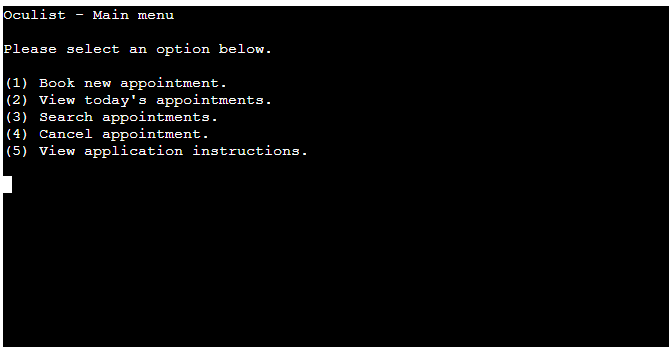
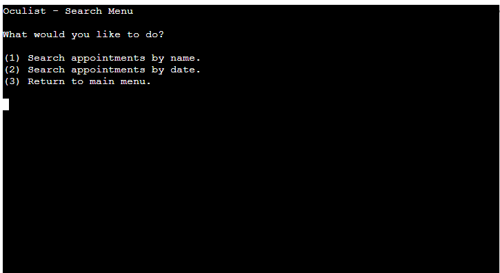
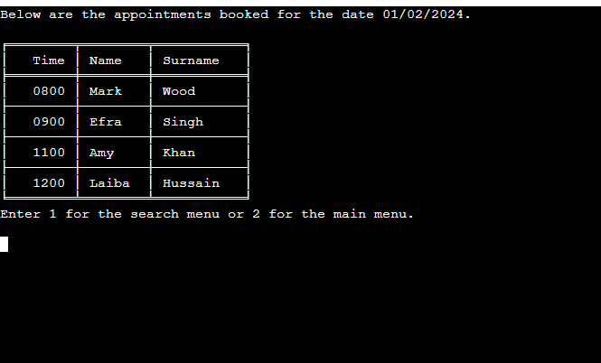
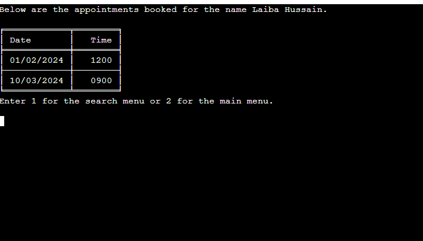
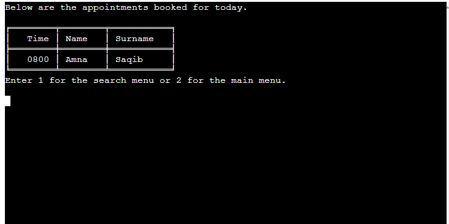
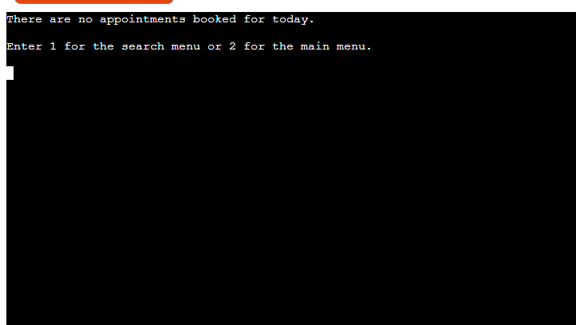
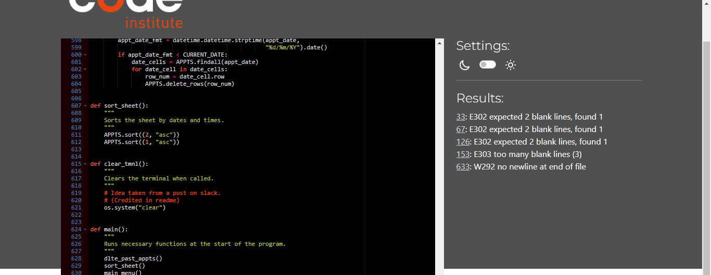

# Oculist

Oculist is a CLI data automation program designed to run on a mock terminal in Heroku. The program is aimed at helping a small optical practice manage and keep track of patient appointments.

View the live site [here](https://oculist-b5e7354efc78.herokuapp.com/).

## Contents

* [Purpose](#purpose)
* [User Experience](#user-experience)
   * [Project Goals](#project-goals)
   * [User Stories](#user-stories)
* [Data Storage](#data-storage-google-sheets)
* [Features](#features)
   * [Existing Features](#existing-features)
      * [The Main Menu](#the-main-menu)
      * [The Search Menu](#the-search-menu)
      * [The Display For Today's Appointments](#the-display-for-todays-appointments)
      * [The Date Input Prompt](#the-date-input-prompt)
      * [The Name Input Prompt](#the-name-input-prompt)
      * [The Cancelation Prompt](#the-cancelation-promp)
      * [Background Features](#background-features)
* [Technologies Used](#technologies-used)
* [Python Packages Used](#python-packages-used)
* [Testing](#testing)
   * [Python PEP8 Validation](#python-pep8-validation)
* [Deployment and Development](#deployment-and-development)
   * [Deploying the App](#deploying-the-app)
   * [Forking The Repository](#forking-the-repository)
   * [Cloning The Repository](#cloning-the-repository)
   * [APIs](#apis)
* [Acknowledgements](#acknowledgements)

## Purpose

The purpose of this program is to make appointment booking and record tracking easier and faster for the user. It provides the ability to input data that has been validated and retrieve specific data upon request. It is intended to enable the user to easily create, delete and view specific records. 

This program is developed to demonstrate competency in python programming and is purely for educational purposes.

## User Experience

### Project Goals

As the site owner, I want the program to:
* provide information on how to use it.
* be easy to navigate.
* provide feedback or a response to the user when they perform a task or action.
* provide the user with the ability to perform tasks relative to the program's purpose.

[Back to top](#contents)

### User Stories

NB - This app is intended to be used by an employee at a small medical practice. The idea is that the user will manage appointments based on requests from patients. An example is a case in which a patient phones the practice to either book or cancel an appointment and the user requests information from the patient to use in order to do so.

As a user, I want to be able to:
* view informational content on how to properly use the program.
* book a new appointment with valid details.
   * enter a detail and have it validated before moving on to the next one.
   * confirm all the details before making the booking.
* view all appointments booked for the current date.
* search for appointments under a specific name and view them.
* search for appointments pertaining to a specific date and view them.
* cancel a specific appointment.

[Back to top](#contents)

## Data Storage (Google Sheets)

The data for the application regarding appointments is stored in a google sheet. You can view the sheet [here](https://docs.google.com/spreadsheets/d/1DjkscJozg2wx8rKzkUOvL64dRgCnFoDZ6prN8B6sAbI/edit#gid=1297538634)

## Features

### Existing Features

Oculist is designed with features that incorporate the purpose of the site. The design and display of the site is limited by factors such as the terminal size and the fact that it is done primarily using python as a CLI app. If the site were to incorporate an interface other than the command line interface for user interaction, a few improvements could be made for a better user experience.

However, the following features outline how the site is best designed to fit needs in its current state.

NB - The app is intended for a single user or a small number of users performing the same job at a medical/optical practice.

* #### The Main Menu
   * When the page is first loaded, the user is presented with the main menu containing options to select from depending on what they want to achieve.

   

   * #### The Search Menu
   * The search menu is displayed when the user chooses the option to search for appointments.
   * This presents the user with options to search for specific appointments.
      * The user can search for a specific name or a specific date.
      * The user may also select an option to return to the main menu.
     

   [Back to top](#contents)

   * #### The Search Results Display
   * Once the user has input a name or date for searching and if appointments are found for the search, the relevant appointments are displayed in a table to be viewed.
      * If the user is searching for a name, only the date and time records will be shown in the table.
      * If the user is searching for a date, only the time and name records will be shown in the table.
   * Images for both displays are shown below.

   
   

   * If no appointments are found for the date or name searched for by the user, they are informed that no appointments exist for the searched detail and are provided with options to return to the search menu to search again or return to the main menu.

* #### The Display For Today's Appointments
   * If the user selects the option in the main menu to view today's appointments, the same process is carried out as in the case of searching by date and the program uses the current date instead of an input date from the user.
   * The relevant responses are given for the result of the search as seen below.
      * If appointments are found for the current date, the records are displayed in a table.

 * If no appointments exist for the current date, the user is informed and given the option to return to the main menu or go to the search menu in case they would like to search for an appointment they expected to be on the current date.

      

[Back to top](#contents)

* #### Background Features

   During the running of the program, a few background features take place. These features include:

   * Sorting the spreadsheet.
      * Whenever the app is run or new data is added to the spreadsheet, the sheet is sorted by date and then by time.
      * This helps keep tidy records that are easier to view and understand.
   
   * Deleting past appointments
      * Each time the app is run, any appointments that contain dates in the past are deleted.
      * This also helps keep tidy records and ensures that no unnecessary records are being kept.

## Technologies used

* [HTML5](https://html.spec.whatwg.org/)
   * Used to add structure and content for the site.
   * (provided in the [code institute template](https://github.com/Code-Institute-Org/python-essentials-template)).
* [CSS](https://www.w3.org/Style/CSS/Overview.en.html)
   * Used to provide styling for the site.
   * (provided in the [code institute template](https://github.com/Code-Institute-Org/python-essentials-template)).
* [Python](https://www.python.org/)
   * Used to provide functionality to the site.
* [Google Sheets](https://www.google.co.uk/sheets/about/)
   * Used to host application data.
* [CodeAnyWhere](https://app.codeanywhere.com/#get-started)
   * Used to create the code and content for the repository.
* [Github](https://github.com/)
   * Used to host the repository.

   ## Python Packages Used

* [GSpread](https://pypi.org/project/gspread/)
   * Used to manipulate data in google sheets.
* [Datetime](https://docs.python.org/3/library/datetime.html)
   * Used to manipulate dates and times.
* [OS](https://docs.python.org/3/library/os.html)
   * Used to clear the terminal.
* [Tabulate](https://pypi.org/project/tabulate/)
   * Used to present data in a table format.
* [PyInputPlus](https://pypi.org/project/PyInputPlus/)
   * Used to display input options as a menu and validate the selected choice.

[Back to top](#contents)

## Testing

Various tests were carried out for this project.

NB - HTML, CSS, and JavaScript were provided in the [code institute template](https://github.com/Code-Institute-Org/python-essentials-template) and are not in scope for this project as well as the aspect of responsive design, therefore they were not taken into consideration.

### Python PEP8 Validation

This project was tested using pep8 validator.And it has no errors.

## Deployment and Development

* The project was developed using [CodeAnyWhere](https://app.codeanywhere.com/) to create the code and files required.
* The project files, code, and information are hosted by [Github](https://github.com/).

### Deploying the App

The deployment of the project was done using [Heroku](https://www.heroku.com/) through the following steps.

1. Log in to Heroku or create an account if necessary.
2. Click on the button labeled "New" from the dashboard in the top right corner and select the "Create new app" option in the drop-down menu.
3. Enter a unique name for the application and select the region you are in.
   * For this project, the unique name is "oculist" and the region selected is Europe.
4. Click on "create app".
5. Navigate to the settings tab and locate the "Config Vars" section and click "Reveal config vars".
6. Add a config var (if the project uses creds.json file.)
   * In the "KEY" field:
      * enter "CREDS" in capital letters.
   * In the "VALUE" field:
      * copy and paste the contents of your creds.json file and click "Add".
7. Add another config var.
   * In the "KEY" field:
      * enter PORT in all capital letters.
   * In the "VALUE" field:
      * enter 8000 and click "Add".
8. Scroll to the "Buildpacks" section and click "Add buildpack".
9. Select Python and save changes.
10. Add another buildpack and select Nodejs then save changes again.
11. Ensure that the python buildpack is above the Nodejs buildpack.
12. Navigate to the "Deploy" section by clicking the "Deploy" tab in the top navbar.
13. Select "GitHub" as the deployment method and click "Connect to GitHub".
14. Search for the GitHub repository name in the search bar.
15. Click on "connect" to link the repository to Heroku.
16. Scroll down and click on "Deploy Branch".
17. Once the app is deployed, Heroku will notify you and provide a button to view the app.

NB - If you wish to rebuild the deployed app automatically every time you push to GitHub, you may click on "Enable Automatic Deploys".

[Back to top](#contents)

### Forking The Repository

This can be done to create a copy of the repository. The copy can be viewed and edited without affecting the original repository.

To fork the repository through GitHub, take the following steps:
1. In the "oculist" repository, click on the "fork" tab in the top right corner.
2. Click on "create fork" to fork the repository.

[Back to top](#contents)

### Cloning The Repository

To clone the repository through GitHub:

1. In the repository, select the "code" tab located just above the list of files and next to the gitpod button.
2. Ensure HTTPS is selected in the dropdown menu.
3. Copy the URL under HTTPS.
4. Open Git Bash in your IDE of choice.
5. Change the current working directory to the location where you want the cloned directory to be created.
6. Type "git clone" and paste the URL that was copied from the repository.
7. Press the "enter" key to create the clone.

[Back to top](#contents)

### APIs 
In order for the app to function properly, APIs need to be set up and connected. In particular, the following APIs were used for this project:

* Google Drive API.
   * This helps with getting credentials to access the files within google drive.
* Google Sheets API.
   * This is the API for the google sheets where the data is stored for the program.

## Acknowledgements

This site was developed as a third portfolio project for the Code Institute course in Full Stack Software Development. 

Amna Saqib 2024

[Back to top](#contents)